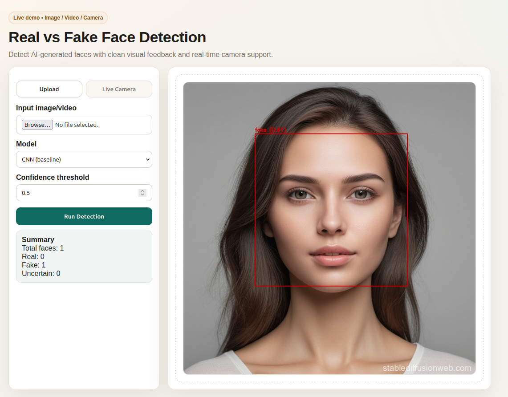

# Real vs Fake Face Detection (AI-Generated vs Real)

## 1) Objective
Build an AI system to detect **real vs AI-generated faces**. The system should:
- Train and evaluate at least two deep learning models.
- Compare model performance and discuss results.
- Support image/video input and visualize results with face bounding boxes.

This repo implements two image-level classifiers (**CNN** and **ResNet18**) and includes **data preparation for a YOLO-style detector**.

## 2) Dataset
**Primary dataset:** 140K Real and Fake Faces (Kaggle)
- Cleaned and re-labeled to numeric folders (0=real, 1=fake).
- Expected directory structure:

```
data/dataset/
├── train/
│   ├── 0/
│   └── 1/
├── validate/
│   ├── 0/
│   └── 1/
└── test/
    ├── 0/
    └── 1/
```

**Label mapping:**
- **0 = real**, **1 = fake**.
- See `utils/dataset.py` for defaults.

### YOLO label generation (for detection model)
`utils/generate_yolo_labels.py` converts the classification dataset into YOLO-style labels using a face detector.

```
PYTHONPATH=. python3 utils/generate_yolo_labels.py
```

Output structure:
```
data/detection/
├── images/
│   ├── train/
│   ├── val/
│   └── test/
└── labels/
    ├── train/
    ├── val/
    └── test/
```

## 3) Deep Learning Models
This project is designed to satisfy the requirement of **at least two models**.

### Model A: CNN Classifier (implemented)
- **Task:** Classify cropped face images as real or fake.
- **Code:**
  - Model: `models/cnn_classifier.py`
  - Training: `training/train_classifier.py`
  - Evaluation: `evaluation/eval_classifier.py`

### Model B: ResNet18 Classifier (implemented)
- **Task:** Classify cropped face images as real or fake using transfer learning.
- **Code:**
  - Model: `models/resnet_classifier.py`
  - Training: `training/train_resnet_classifier.py`
  - Evaluation: `evaluation/eval_resnet_classifier.py`

### Model C: YOLO-Style Face Detector (data prep included)
- **Task:** Detect faces and classify each bounding box as real/fake.
- **Code:**
  - Data preparation: `utils/generate_yolo_labels.py`
- **Note:** Training/inference for YOLO is not included yet. You can train with a YOLO framework (e.g., Ultralytics) using the generated `data/detection/` labels.

### Optional/Extension: Sequence Model (video-level)
- **Idea:** Aggregate frame-level predictions for video inputs (e.g., LSTM/GRU/Temporal CNN).
- **Status:** Not implemented in this repo yet.

## 4) Training & Evaluation (CNN / ResNet18)
Create a virtual environment and install dependencies:

```
python -m venv venv
source venv/bin/activate
pip install torch torchvision opencv-python matplotlib scikit-learn seaborn flask pillow
```

Train the CNN classifier:
```
PYTHONPATH=. python3 training/train_classifier.py
```
Tip: if your machine can handle it, use `--num-workers 4` to speed up data loading (fallback to 0 if you see permission errors).

Evaluate the trained model:
```
PYTHONPATH=. python3 evaluation/eval_classifier.py --num-workers 0
```

Results are saved to:
```
results/cnn/
├── metrics.json
└── confusion_matrix.png
```

Train the ResNet18 classifier:
```
PYTHONPATH=. python3 training/train_resnet_classifier.py
```
Optional flags: `--pretrained` (uses ImageNet weights) and `--freeze-backbone` (train only the final layer).

Evaluate the ResNet18 model:
```
PYTHONPATH=. python3 evaluation/eval_resnet_classifier.py --num-workers 0
```

Results are saved to:
```
results/resnet/
├── metrics.json
└── confusion_matrix.png
```

### Sanity Check (Random Samples)
Quickly inspect predictions on random test images:
```
PYTHONPATH=. python3 evaluation/sanity_check.py --model resnet18 --model-path resnet_face_classifier.pth --num-samples 10
```

### Evaluation Summary (Test Set)
| Model | Accuracy | Precision | Recall | F1-score |
| --- | --- | --- | --- | --- |
| CNN | 0.9666 | 0.9760 | 0.9440 | 0.9597 |
| ResNet18 | 0.9754 | 0.9764 | 0.9743 | 0.9754 |

Notes:
- CNN results are from `results/cnn/metrics.json` (after relabeling to 0=real, 1=fake).
- ResNet18 results are from `results/resnet/metrics.json`.

Discussion:
- The CNN baseline performs well on the relabeled dataset with balanced precision/recall.
- ResNet18 outperforms the CNN baseline on all reported metrics in this run.
- Further gains are possible with ImageNet initialization (`--pretrained`) and additional augmentation.

## 5) Inference / Web App
Goal: input image/video -> detect faces -> classify real/fake -> draw bounding boxes.

Implemented inference pipeline:
- Face detection: MTCNN via `facenet-pytorch` (`inference/detect_faces.py`)
- Classification: CNN or ResNet18 (`inference/predict_classifier.py`)
- Visualization: bounding boxes + labels (`inference/visualize.py`)

Run the web app:
```
PYTHONPATH=. python3 webapp/app.py
```

Then open: http://localhost:5000

#### Live Camera Mode
- Click **Live Camera** in the UI to stream from your local webcam.
- The camera runs on the **same machine** as the Flask server.
- You can adjust model, confidence threshold, and frame stride for performance.

### How to Run the Web App (Step-by-step)
1) Make sure you have model weights:
   - `cnn_face_classifier.pth` for CNN
   - `resnet_face_classifier.pth` for ResNet18
2) Start the server:
```
PYTHONPATH=. python3 webapp/app.py
```
3) Open the app in your browser: `http://localhost:5000`
4) Upload an image or video and select the model.
5) The app will draw bounding boxes and label each face as real or fake.

### Usage Notes
- If no faces are detected, the app will show a warning.
- Video processing samples frames (stride=2) to keep it fast.
- Outputs are saved to `webapp/static/outputs/` and displayed in the UI.
- If you see a "Model weights not found" error, confirm the `.pth` files exist in the project root.

### Screenshots
Sample web app result:



## 6) Project Structure
```
models/         # CNN model definition
training/       # training scripts
evaluation/     # evaluation scripts
utils/          # dataset utils + YOLO label generator
inference/      # inference pipeline
webapp/         # Flask web application
results/        # evaluation outputs
```

## 7) Notes on Project Requirements
To fully satisfy the project requirements, ensure you:
- Train **at least two** deep learning models.
- Compare their performance (accuracy/F1/confusion matrix).
- Discuss results in your technical report (max 4 pages).

## 8) References

```
Kaggle Dataset: 140K Real and Fake Faces
Kaggle Dataset: Real vs AI-Generated Faces (philosopher0808)
https://www.kaggle.com/datasets/philosopher0808/real-vs-ai-generated-faces-dataset/data

This repo now includes two models and a basic web app for detection and visualization.
